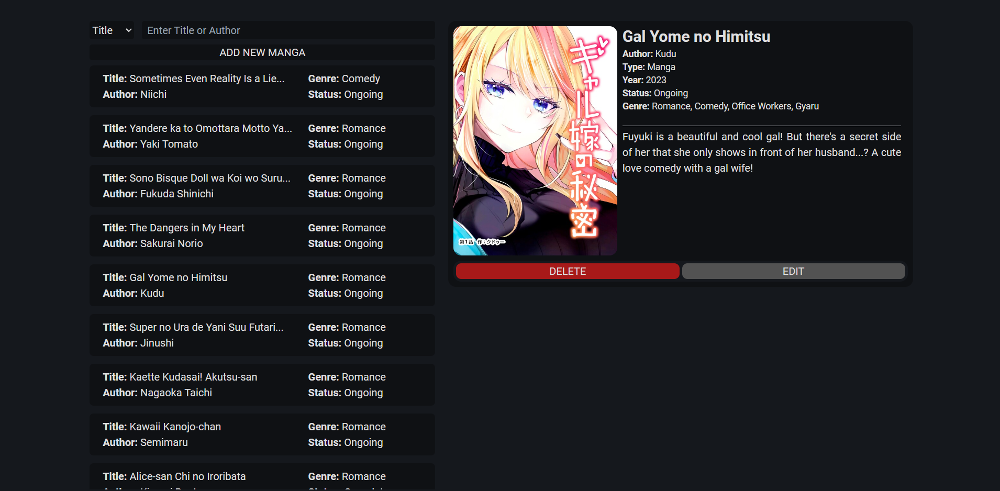
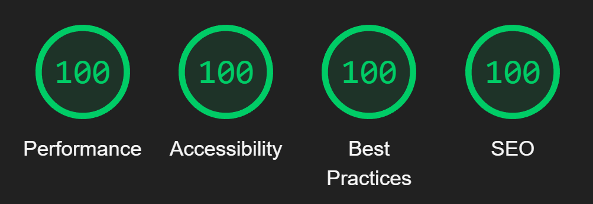

# Manga Collection  

Simple User Interface for CRUD operations using a express based [REST API](https://github.com/R-uan/manga-collection-api)
<h3>Functionalities</h3>
<ul> 
   <li>Add New Mangas</li>
   <li>List All Mangas</li>
   <li>Search Mangas by title or author</li>
   <li>Edit Existing Mangas</li>
   <li>Delete Existing Mangas</li>
</ul>
<h3>Limitations</h3>
<ul> 
   <li>Relies on third party for image storage</li>
   <li>No support for personal lists</li>
</ul>

## Technologies Used

  
  
  
  

## Preview

## Built Preview Lighthouse

